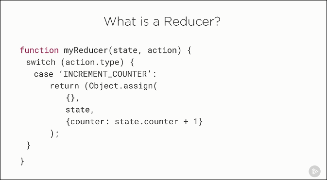
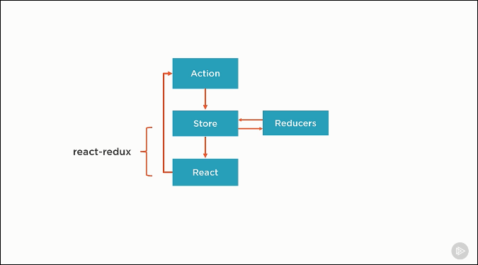
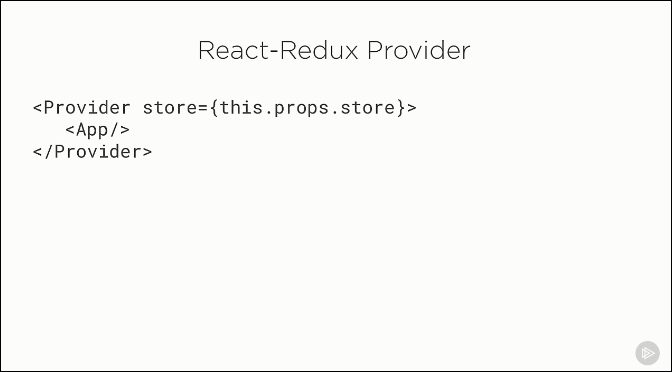
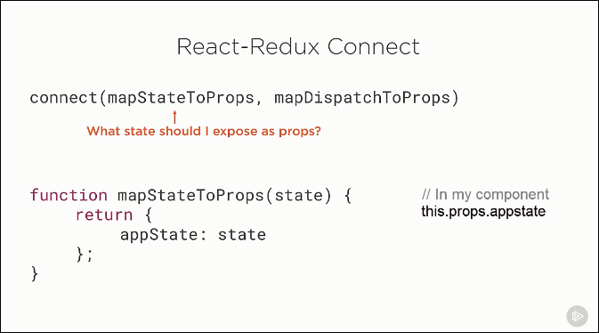
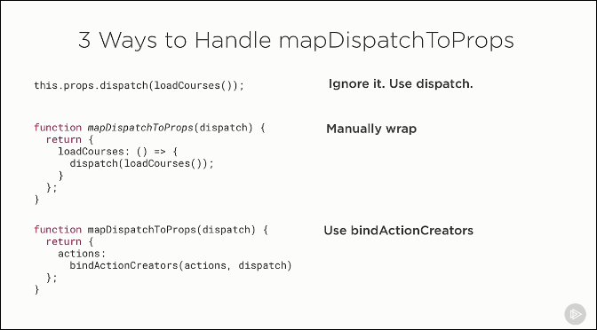

# Index

* Types of React Components
    * Stateless Functional Components Benefits
    * When to Use Class Components
    * When to use Stateless Components
* Container vs Presentation Components
* When do I Need Redux
* Flux vs Redux
    * Simlarities
    * Differences
* Immutability
    * Using `Object.assign()`
    * Why Immutability
    * Handling Immutability
* Redux Flow
    * Actions
    * Store 
    * Reducers
        * Recommended
        * On dispatch
        * Forbidden in Reducers
* How to connect React to Redux
    * Provider component
    * Connect component
        * Advantages of Using `connect()`
        * Specify what state to expose on props
        * Memoize
        * Specify what actions to expose on props
            * Option 1: Use Dispatch Directly
            * Option 2: Wrap Manually
            * Option 3: `bindActionCreators()`

## Types of React Components

* ES5 Class Components
* ES5 Stateless Components
* ES6 Class Components
* ES6 Stateless Components

### Stateless Functional Components Benefits

https://app.pluralsight.com/player?course=react-redux-react-router-es6&author=cory-house&name=react-redux-react-router-es6-m3&clip=5&mode=live

* No class needed
* Avoid `this` keyword
* Enforced best practices
* High signal-to-noise ratio
* Enhanced code completion
* Bloated components
* Easy to understand
* Easy to test
* Performance

### When to Use Class Components
* When you need to maintain state
* Require reference to the DOM
* Require lifecylcle methods
* If you need to create Child (nested) functions. Because every render with stateless function would create new instance of child function.

### When to use Stateless Components
Everywhere possible.

## Container vs Presentation Components

### Container components
Aka Smart or Stateful or Controller View component.

* Have little to no markup.
* Passes data and actions down to the presentation components.
* Knows about Redux.
* Subscribe to redux state.
* Dispatch redux actions.
* These components are generated by `react-redux`.

### Presentation components
Aka Dumb or Stateless or View component.
 
* Are nearly all markup.
* They shouldnt have any logic inside.
* Receive data and actions via props.
* Doesnt know about Redux.
* Invoke callbacks on props.
* These are written by hand, mostly have `render()` function.

## When do I Need Redux

* Complex data flows
* Interactions between components
* When application has non-hierarchical data
* Using same data in multiple places
* Redux becomes really useful when the app has increasing number of actions

## Flux vs Redux

### Simlarities

* Unidirectional flow - All data changes flow in one direction
* Actions - Define action that change state
* Stores - Flux has single store while Redux has multiple

### Differences

* Redux introduces reducers that are pure functions
* Flux stores contain state and change logic. Redux store and change logic are seperate.
* Flux supports having multiple stores. Redux has only one store.
* Flux stores are flat and disconnected. Redux has single store with hierarchical reducers.
* Flux has actions, dispatchers and stores. Flux uses a singleton dispatcher. Redux doesn't have dispatcher. It relies on pure functions called reducers.
* Flux requires components to subscribe to store. Redux connects components to store automatically. This is done using connect method.
* State is mutable in Flux. Redux the state is immutable.

## Immutability
To change state, return a new object.

Types already immutable:

* Number
* String
* Boolean
* undefined
* null

Types that are mutable:

* Objects
* Arrays
* Functions

Immutability suggests to return new object instead of doing direct value update.

```js
state.role = 'admin';
return state;
```

Instead of above return the object as follows:

```js
state = {
  name: "jagdeep bisht",
  role: "admin"
}
```

### Using `Object.assign()`

#### Syntax

```js
Object.assign(target, ...sources)
```

#### Example

```js
Object.assign({}, state, {role: "author" });
```

### Why Immutability

* Clarity - We know where and how the state was changed
* Performance - Only reference check is required to identify change
* Debugging
    * Time travel debugging support
    * Undo/Redo
    * Turn off individual actions
    * Play interactions back

### Handling Immutability

> Javascripts primitives are immutable

#### `ES6`

* Object.assign
* Spread Operator

#### `ES5`

* Lodash merge
* Lodash extend
* Object-assign

#### Libraries

* react-addons-update
* Immutable.js

### How to enforce Immutability

* Manually ensure that
* redux-immutable-state-invariant
* Immutable.js

## Redux Flow


### Actions
Actions happening in the application are  plain objects. And pure functions are recommended to create these objects, which are called Action Creators.

Typically action creator function name is same as action type.


Any value can be passed through an action.

Anything that doesnt serialize to JSON is not supported. Eg. functions or promises.

When an action is dispatched a change in store is triggered.

### Store
Redux store follows single responsibility principle.

A store is created in the application entry point.

```js
let store = createStore(reducers);
```

Redux store api:


Reason for padlock icon on the store:

> A store is immutable.

While reducers are responsible for state change.

### Reducers
Takes out a state and action, and returns a new state.



> Reducers must be pure

#### Recommended
Write independent small reducer functions that are responsible for updates to a specific slice of state. This pattern is called `reducer composition`. 

A given action could be handled by all, some or none of them.

> One Store. Multiple Reducers

#### On dispatch

> All reducers are called.

#### Forbidden in Reducers

* Mutate arguments
* Perform side effects
* call non-pure functions

## How to connect React to Redux
Here is where react and redux are linked to each other.



React and redux have following core components:

* `Provider` component - Attaches app to store
* `Connect` component - Creates container components

### Provider component
Provider component is used to wrap the entire application as follows:



Redux uses React's `context` object. Provider component makes the store available to the entire application.

### Connect component
This wraps our component so its connected to the Redux store.

```js
export default connect(
  mapStateToProps,
  mapDispatchToProps
)(AuthorPage);
```

Here we specify:

* `mapStateToProps` - What part of the store we would like to be attached to our component as props.
* `mapDispatchToProps` - Specify what actions you want to expose on props.

#### Advantages of Using `connect()`

* No manual unsubscribe (unlike Flux)
* No lifecycle methods required
* Declare what subset of state you want
* Enhanced performance

#### Specify what state to expose on props


#### Memoize
Memoizing is like caching for function call.

Every time the component is updated the `mapStateToProps()` function is called.

When doing expensive work in `mapStateToProps`, you can use a library like **reselect**. This library keeps track of the results of each function call. So that the function doesnt have to be called if same params are passed to it again.

#### Specify what actions to expose on props



##### Option 1: Use Dispatch Directly
When using connect, a `dispatch()` function is automatically added to the `props`.

```js
// In component...
this.props.dispatch(loadCourses())
```

Problem with this is:

* More boilerplate
* Child component need to reference redux specific concepts like dispatch.

##### Option 2: Wrap Manually
We wrap each action creator one by one as follows:

```js
function mapDispatchToProps(dispatch) {
  return {
    loadCourses: () => {
      dispatch(loadCourses());
    },
    createCourse: (course) => {
      dispatch(createCourse(course));
    }
  };
}
```

And then call these actions on props as follows:

```js
// In component...
this.props.loadCourses()
```

##### Option 3: `bindActionCreators()`
Redux provides us with `bindActionCreators()`. It binds all the actions passed to it in a dispatch call.

```js
function mapDispatchToProps(dispatch) {
  return {
    actions: bindActionCreators(actions, dispatch)
  };
}
```

Props created by the above method would be different from Option 2.

```js
// In component...
this.props.actions.loadCourses()
```

> With Option 2 and 3, child components doesnt have to know anything about redux

# References
https://medium.freecodecamp.org/why-i-left-gulp-and-grunt-for-npm-scripts-3d6853dd22b8
