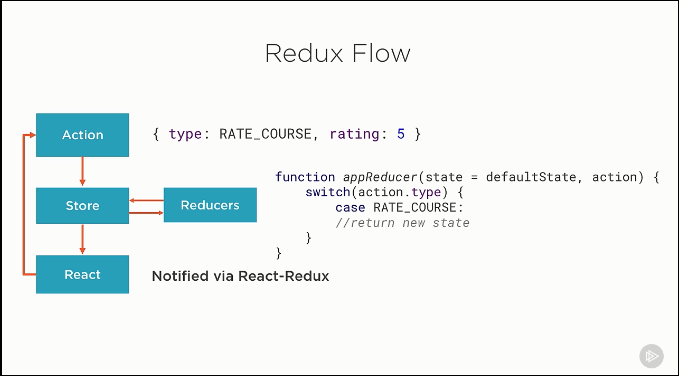
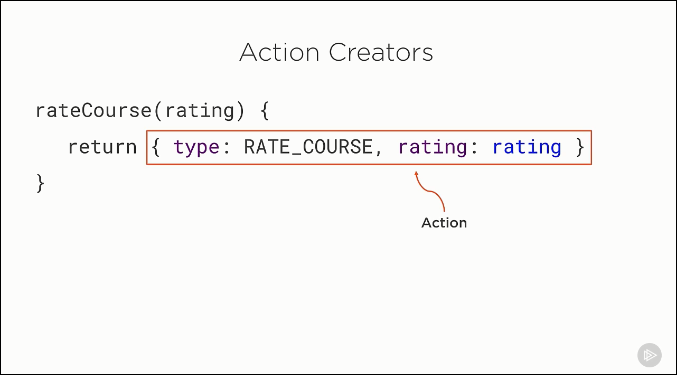
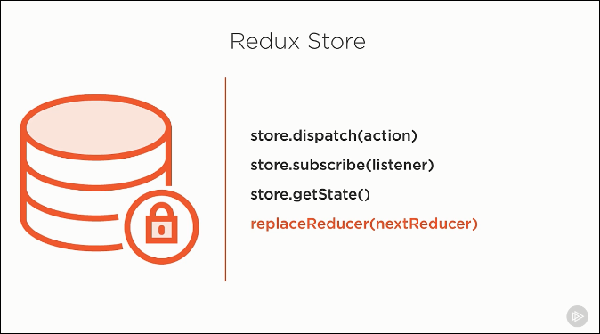

# Index

* Types of React Components
    * Stateless Functional Components Benefits
    * When to Use Class Components
    * When to use Stateless Components
* Container vs Presentation Components
* When do I Need Redux
* Flux vs Redux
    * Simlarities
    * Differences
* Redux Flow
    * Actions
    * Store 
    * Reducers
        * Immutability
        * Using `Object.assign()`
        * Why Immutability

## Types of React Components

* ES5 Class Components
* ES5 Stateless Components
* ES6 Class Components
* ES6 Stateless Components

### Stateless Functional Components Benefits

https://app.pluralsight.com/player?course=react-redux-react-router-es6&author=cory-house&name=react-redux-react-router-es6-m3&clip=5&mode=live

* No class needed
* Avoid `this` keyword
* Enforced best practices
* High signal-to-noise ratio
* Enhanced code completion
* Bloated components
* Easy to understand
* Easy to test
* Performance

### When to Use Class Components
* When you need to maintain state
* Require reference to the DOM
* Require lifecylcle methods
* If you need to create Child (nested) functions. Because every render with stateless function would create new instance of child function.

### When to use Stateless Components
Everywhere possible.

## Container vs Presentation Components

### Container components
Aka Smart or Stateful or Controller View component.

* Have little to no markup.
* Passes data and actions down to the presentation components.
* Knows about Redux

### Presentation components
Aka Dumb or Stateless or View component.
 
* Are nearly all markup.
* They shouldnt have any logic inside.
* Receive data and actions via props.
* Doesnt know about Redux

## When do I Need Redux

* Complex data flows
* Interactions between components
* When application has non-hierarchical data
* Using same data in multiple places
* Redux becomes really useful when the app has increasing number of actions

## Flux vs Redux

### Simlarities

* Unidirectional flow - All data changes flow in one direction
* Actions - Define action that change state
* Stores - Flux has single store while Redux has multiple

### Differences

* Redux introduces reducers that are pure functions
* Flux stores contain state and change logic. Redux store and change logic are seperate.
* Flux supports having multiple stores. Redux has only one store.
* Flux stores are flat and disconnected. Redux has single store with hierarchical reducers.
* Flux has actions, dispatchers and stores. Flux uses a singleton dispatcher. Redux doesn't have dispatcher. It relies on pure functions called reducers.
* Flux requires components to subscribe to store. Redux connects components to store automatically. This is done using connect method.
* State is mutable in Flux. Redux the state is immutable.

## Redux Flow


### Actions
Actions happening in the application are  plain objects. And pure functions are recommended to create these objects, which are called Action Creators.

Typically action creator function name is same as action type.



Any value can be passed through an action.

Anything that doesnt serialize to JSON is not supported. Eg. functions or promises.

When an action is dispatched a change in store is triggered.

### Store
Redux store follows single responsibility principle.

A store is created in the application entry point.

```js
let store = createStore(reducers);
```

Redux store api:



Reason for padlock icon on the store:

> A store is immutable.

While reducers are responsible for state change.

### Reducers

#### Immutability
To change state, return a new object.

Types already immutable:

* Number
* String
* Boolean
* undefined
* null

Types that are mutable:

* Objects
* Arrays
* Functions

Immutability suggests to return new object instead of doing direct value update.

```js
state.role = 'admin';
return state;
```

Instead of above return the object as follows:

```js
state = {
  name: "jagdeep bisht",
  role: "admin"
}
```

#### Using `Object.assign()`

##### Syntax

```js
Object.assign(target, ...sources)
```

##### Example

```js
Object.assign({}, state, {role: "author" });
```

#### Why Immutability

* Clarity - We know where and how the state was changed
* Performance - Only reference check is required to identify change
* Debugging
    * Time travel debugging support
    * Undo/Redo
    * Turn off individual actions
    * Play interactions back

# References
https://medium.freecodecamp.org/why-i-left-gulp-and-grunt-for-npm-scripts-3d6853dd22b8
